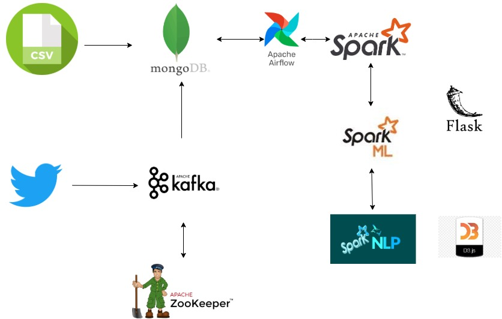

# COVID Tweet Analytics

All of the countries have been affected by COVID-19 pandemic. Governments have come up with different measures to curb the spread as much as possible. With our project, we will analyze citizen’s reactions on the measures taken by the government and see if the measures have been accepted positively or negatively by the people. With the analysis of twitter location data, we plan to build a system/model which analyzes the places where firm social distancing measures took place and a reduction in COVID cases were seen. In some states, people’s movement did not change much and there was a rapid growth in the number of COVID-19 cases reported. The technologies we will use are Spark, Kafka, MongoDB, Spark ML and Altair.

# Datasets Used

* Livestreaming covid19 tweets via tweepy.
* March twitter data via Kaggle.
* Google mobility reports data
* Data for major COVID19 events 

# Architecture
  

